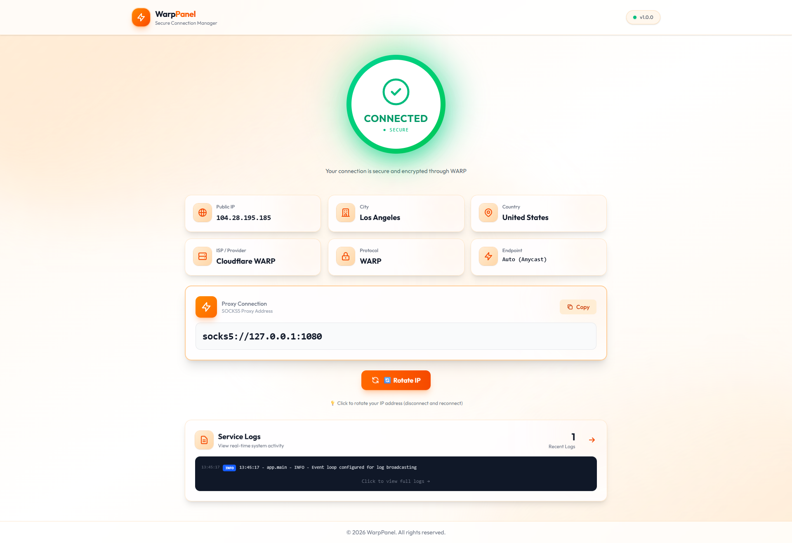

<div align="center">

# Lumina

[](LICENSE)
[](https://hub.docker.com/r/crisocean/lumina)
[](https://vuejs.org/)
[](https://fastapi.tiangolo.com/)
[](VERSION)

**现代化 Cloudflare WARP 管理面板**

[功能特性](#-功能特性) • [技术栈](#️-技术栈) • [快速开始](#-快速开始) • [使用说明](#-使用说明) • [Linux 原生部署](#-linux-原生部署)

---



</div>

**Lumina** 是一个专为管理 Cloudflare WARP 客户端而设计的现代化 Web 管理面板。采用精美的 **玻璃拟态（Glassmorphism）** 界面风格，支持在 **官方客户端** 与 **usque** 两种引擎之间无缝切换，让您轻松掌控网络连接。

## ✨ 功能特性

- **🎯 精准的单实例管理**
  精细化控制 WARP 容器。实时状态同步，低资源占用，完美适配 VPS 或本地部署场景。

- **🔄 双后端架构**
  - **`usque` (MASQUE 协议)**：高性能、轻量级 Go 实现，速度极快，资源占用极低（**推荐**）。
  - **`官方客户端`**：Cloudflare 官方 Linux 客户端，兼容性最佳。
  - **无缝切换**：无需重启容器，即可在两种后端之间即时切换。

- **🌐 SOCKS5 代理模式**
  作为 SOCKS5 代理运行，外部应用可通过代理端口（`:1080`）将流量路由至 WARP 网络。

- **🔧 MASQUE 协议支持**
  采用现代 HTTP/3 隧道协议，具备更强的抗干扰能力和更快的连接速度。

- **⚡ 性能与响应**
  - **非阻塞架构**：后端操作全程异步，确保 UI 界面始终流畅响应。
  - **实时监控**：基于轮询的状态实时更新。
  - **智能缓存**：高效缓存 IP 与状态信息，最大程度降低系统开销。

- **🎨 沉浸式 UI 设计**
  基于 Vue 3 + Tailwind CSS v4 构建，完全响应式布局，过渡动画流畅自然。

- **🛡️ 安全与智能管理**
  - **安全代理**：SOCKS5 端口默认绑定至 `127.0.0.1`，防止未授权的外部访问。
  - **日志清洗**：智能过滤冗余连接日志，只展示关键信息。
  - **内核管理**：支持 `usque` 内核的自动更新与版本管理。
  - **密码保护**：可为 Web 面板启用可选的登录认证。

## 🛠️ 技术栈

| 模块 | 技术 | 说明 |
| :--- | :--- | :--- |
| **前端** | Vue 3, Vite, Tailwind CSS v4 | 原子化 CSS，高效开发 |
| **后端** | Python 3.10+, FastAPI, AsyncIO | 高性能异步 Web 框架 |
| **核心引擎** | Cloudflare WARP 官方 + usque | 官方稳定性 + 社区高性能 |
| **部署方式** | Docker / Linux 原生 | 容器化或直接安装 |

## 🚀 快速开始

### 前置要求
- **Docker**（Desktop 或 Engine）
- **Git**（源码构建时需要）

### 方式一：Docker Hub 拉取镜像（推荐）

无需本地构建，直接使用预构建镜像运行。

**1. 创建 `docker-compose.yml`**

```yaml
services:
  lumina:
    image: crisocean/lumina:latest
    container_name: lumina-client
    restart: unless-stopped
    cap_add:
      - NET_ADMIN
    devices:
      - /dev/net/tun:/dev/net/tun
    environment:
      - WARP_BACKEND=usque  # 可选: 'usque'（默认）或 'official'
      # - PANEL_PASSWORD=secret  # 可选: 为面板设置访问密码
    ports:
      - "8000:8000"             # Web 管理面板
      - "127.0.0.1:1080:1080"   # SOCKS5 代理（仅本地访问）
    volumes:
      - lumina_data:/var/lib/cloudflare-warp
      - lumina_usque:/var/lib/warp
      - lumina_config:/app/data

volumes:
  lumina_data:
  lumina_usque:
  lumina_config:
```

**2. 启动服务**

```bash
docker compose up -d
```

### 方式二：源码构建

```bash
# 1. 克隆仓库
git clone https://github.com/CrisRain/lumina.git
cd lumina

# 2. 构建并启动
docker compose up --build -d
```

启动后，浏览器访问：**[http://localhost:8000](http://localhost:8000)**

---

## 📖 使用说明

1. **连接 WARP**
   点击 **Connect** 按钮即可发起连接。

2. **切换后端**
   通过下拉菜单在 **Usque** 和 **Official** 两种后端之间切换。

3. **内核管理**
   进入 **Kernel**（内核）页面，可管理 `usque` 版本、检查更新或切换活跃版本。

4. **设置**
   在 **Settings**（设置）页面中配置面板登录密码及代理端口。

   > ⚠️ 注意：若在容器内修改了面板端口或 SOCKS5 端口，需同步更新 `docker-compose.yml` 中的 `ports:` 映射，并重新创建容器才能在宿主机上生效。

5. **日志**
   在 **Logs**（日志）页面查看实时服务运行日志。

## 🔒 安全说明

> **重要提示**：SOCKS5 代理默认绑定至 `127.0.0.1`，不对外网直接暴露。

如需远程访问代理，推荐使用 SSH 隧道转发：

```bash
ssh -L 1080:127.0.0.1:1080 your-server-ip
```

如需公开暴露（不推荐），请将 `docker-compose.yml` 中的端口映射修改为 `"1080:1080"`。

---

## 🐧 Linux 原生部署

无需 Docker，直接在 Ubuntu / Debian 系统上运行。

```bash
git clone https://github.com/CrisRain/lumina.git
cd lumina
chmod +x linux_install.sh
sudo ./linux_install.sh
```

### 常用管理命令

```bash
# 查看服务状态
sudo supervisorctl status

# 重启所有服务
sudo supervisorctl restart all
```

## 💻 开发调试

<details>
<summary>本地开发环境搭建</summary>

### 前端

```bash
cd frontend
npm install
npm run dev
```

### 后端

```bash
cd backend
pip install -r requirements.txt
uvicorn app.main:app --reload
```

</details>

## 📄 开源协议

本项目基于 [MIT License](LICENSE) 开源。
